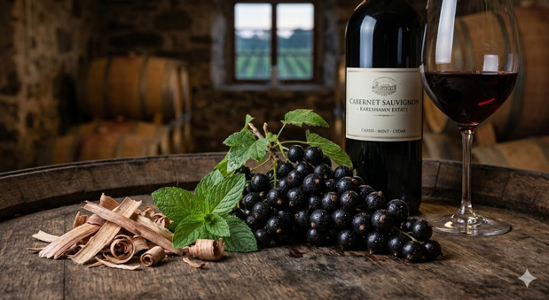

---
layout: page
title: Cabernet Sauvignon
---
# Cabernet Sauvignon

## Typiska aromer
- **Mörk frukt:** Svarta vinbär (cassis), mörka körsbär.
- **Grön frukt/Vegetativt:** Grön paprika, mynta, eukalyptus, tomatblad.
- **Från ekfat/trä:** Blyertspenna, ceder, cigarrlåda, kaffe

## Smakprofil
- **Fyllighet:** Hög
- **Strävhet:** Hög
- **Syra:** Hög

## Färg och utseende

- **Nyans:** Mörk blåröd till violett.
- **Täthet:** Mycket hög
