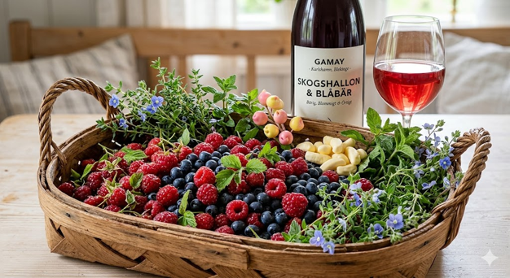

# Gamay

## Typiska aromer
- **Röda/Blå bär:** Hallon, smultron, körsbär, blåbär.
- **Blommigt/Örtigt:** Pion, viol, färska gröna örter.
- **Speciella toner från kolsyrejäsning:** Skumbanan, bubbelgum, kirsch.

## Smakprofil
- **Fyllighet:** Låg till medel
- **Strävhet:** Låg
- **Syra:** Hög

## Färg och utseende

- **Nyans:** Röd till blåröd
- **Täthet:** Låg
