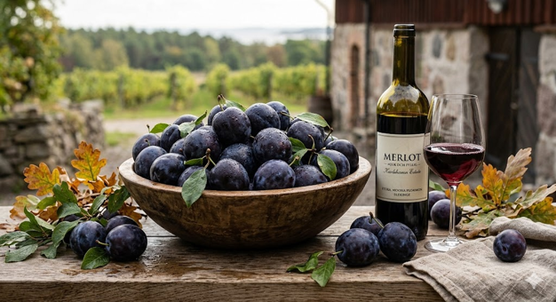

---
layout: page
title: Merlot
---

## Typiska aromer
- **Mörk frukt:** Plommon och björnbär. Plommon är främsta kännetecken.
- **Choklad:** Särskilt mjuk mjölkchoklad eller kakao.
- **Örtighet:** Lagerblad och te.

## Smakprofil
- **Fyllighet:** Hög
- **Strävhet:** Medel till hög
- **Syra:** Medel

## Färg och utseende
- **Nyans:** Från rött till djupt rubinröd
- **Täthet:** Hög

