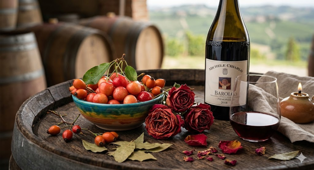

---
layout: page
title: Nebbiolo
---

## Typiska aromer
- **Röda bär/frukt:** Körsbär, nypon, skogsbär
- **Blommigt:** Rosor, viol
- **Tertiära toner:** Tjära, tobak, lakrits, läder

## Smakprofil

  
  
  

## Färg och utseende
- **Nyans:** Röd till tegelröd (orangeaktig kant vid mognad)
- **Täthet:** Låg till medel

