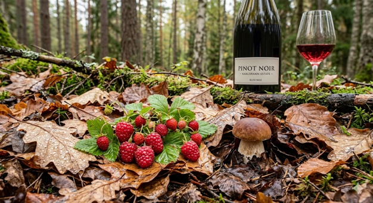

# Pinot Noir

## Typiska aromer
- **Röd frukt:** Jordgubbar, hallon, körsbär.
- **Kryddigt:** Kanel, nejlika, sandelträ.
- **Vegetation/Jordighet:** Multna löv, svamp, fuktig jord, undervegetation.

## Smakprofil
- **Fyllighet:** Låg till medel
- **Strävhet:** Låg
- **Syra:** Hög

## Färg och utseende

- **Nyans:** Röd till rubinröd (blir snabbt tegelröd med ålder)
- **Täthet:** Låg
