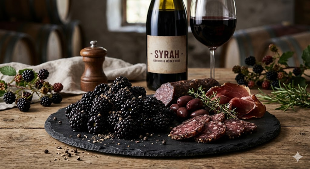

# Syrah

## Typiska aromer
- **Mörk frukt:** Björnbär, plommon, svarta körsbär.
- **Kryddigt:** Svart- och vitpeppar, lakrits, choklad
- **Charkuterier/Animaliskt:** Rökt kött, läder.

## Smakprofil
- **Fyllighet:** Medel till hög
- **Strävhet:** Medel till hög
- **Syra:** Hög

## Färg och utseende
- **Nyans:** Mörkröd till blålila.
- **Täthet:** Hög till mycket hög
